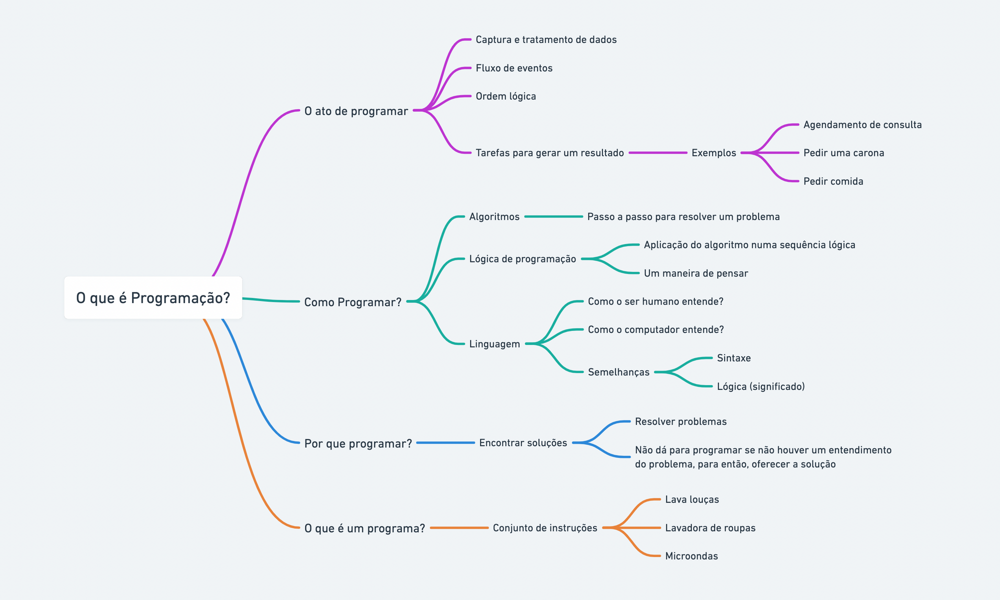

# AULA 01 - O QUE É PROGRAMAÇÃO?

## Conteúdo da aula

- O que é programação?
- Como programar ?
- Por que programar?
- O que é um programa?

---

## O QUE É PROGRAMAÇÃO?

Programação é o processo de criar um conjunto de instruções que dizem a um computador como executar uma tarefa específica. Essas instruções são escritas usando linguagem de programação, que é um conjunto de regras e símbolos que permitem que os humanos comuniquem suas intenções para o computador.

A programação é uma parte fundamental da computação e está presente em uma variedade de constextos, desde o desenvolvimento de software para aplicativos e sistemas operacionais até a criação de scripts para automação de tarefas. Os programadores escrvem códigos-fonte usando linguagens de programação, e esse código é então traduzido por um compilador ou interpretador para instruções compreensíveis pelo computador.

Existem muitas linguagens de programação diferentes, cada uma com suas próprias características e usos específicos. Algumas linguagens são mais adequadas para tarefas específicas, como desenvolvimento web, ciência de dados, inteligência artificial, sistemas embarcados, entre outros. A linguagem utilizada no estudo é o JavaScript, e com ele podemos criar aplicações web e também API's web.

A programação envolve habilidade lógicas, resolução de problemas e criatividade, pois os programadores precisam projetar algoritmos eficientes e encontrar soluções para os desafios que surgem durante o desenvolvimento de software.

---

## COMO PROGRAMAR?

Programar envolve vários passos, desde a compreensão do problema que se está tentando resolver até a implementação efetiva do código. Abaixo estão alguns passos gerais que podemos seguir para programar com eficiencia:

- **Entender o Problema**: É crucial ter uma compreensão clara do problema que estamos tentando resolver. Identificando os requisitos e as metas do problema;
- **Escolha da Linguagem de Programação**: Selecione uma lingaugem de programação adequada para o problema em questão. A escolha depende do tipo de aplicação que será desenvolvido e das suas preferências pessoais.
- **Planeje sua Solução**: Antes de começar a codificar, faça um plano para a solução. Pode ser útil criar uma algoritmo ou fluxograma que descreva a lógica do programa.
- **Escreva o Código**: Transponha seu plano para o código. Escreva as instruções em conformidade com a sintaxe da linguagem de programação escolhida.
- **Teste o Código:** Teste seu código para garantir que ele funcione conforme esperado. Identifique e corrija quaisquer erros (bugs) que você encontrar.
- **Depure o Código**: A depuração é o processo de identificar, isolar e corrigir problemas no código. Utilize ferramentas de depuração e mensagens de saída (como impressões na tela) para entender o comportamento do programa.
- **Refatore o Código (se necessário)**: Refatoração envolve melhorar a estrutura do código sem alterar seu comportamento. Isso pode incluir a organização de funções, a simplificação de algoritmos ou a melhoria da legibilidade do código.
- **Documente o Código**: Adicione comentários ao seu código para explicar partes complexas, o propósito de funções e variáveis, facilitando a compreensão do código por outros desenvolvedores (ou por você mesmo no futuro).
- **Itere e Melhore**: Se necessário, faça iterações no processo. Refine e melhore seu código à medida que você ganha mais compreensão do problema e das possíveis soluções.
- **Versionamento (opcional)**: Se estiver trabalhando em um projeto maior ou em colaboração com outras pessoas, considere o uso de sistemas de controle de versão, como Git, para rastrear alterações e facilitar a colaboração.

A prática é fundamental para melhorar suas habilidades de programação. À medida que você ganha experiência, ficará mais confortável com a lógica de programação, a resolução de problemas e a utilização eficaz das ferramentas disponíveis em sua linguagem escolhida.

---

## POR QUÊ PROGRAMAR?

Programar oferece uma variedade de benefícios e oportunidades. Aqui estão algumas razões pelas quais muitas pessoas escolhem aprender a programar:

- **Resolução de Problemas:** A programação envolve a resolução de problemas. Os programadores desenvolvem algoritmos e criam soluções eficientes para uma variedade de desafios, o que estimula o pensamento lógico e analítico.
- **Criatividade e Inovação**: Programar permite que você crie coisas novas, desde aplicativos úteis até jogos envolventes. A capacidade de transformar suas ideias em realidade estimula a criatividade e a inovação.
- **Oportunidades Profissionais**: Há uma alta demanda por profissionais de tecnologia e programadores em diversas indústrias. A programação abre portas para uma variedade de oportunidades de carreira em desenvolvimento de software, análise de dados, inteligência artificial, cibersegurança e muito mais.
- **Automatização**: A programação permite a automatização de tarefas repetitivas e rotineiras. Isso não apenas economiza tempo, mas também reduz erros humanos, melhorando a eficiência.
- **Entendimento Tecnológico**: Aprender a programar oferece uma compreensão mais profunda de como a tecnologia funciona. Isso é cada vez mais importante em um mundo onde a tecnologia desempenha um papel central em muitos aspectos da vida cotidiana e dos negócios.
- **Flexibilidade e Mobilidade**: Programadores muitas vezes têm a flexibilidade de trabalhar em diferentes projetos e, em alguns casos, até remotamente. Isso proporciona uma maior flexibilidade em relação ao local e ao tipo de trabalho.
- **Compreensão de Software**: Ao programar, você desenvolve uma compreensão mais profunda de como o software é construído. Isso é valioso, mesmo se você não estiver buscando uma carreira em programação, pois muitas profissões exigem interação com sistemas computacionais.
- **Contribuição para a Comunidade**: A programação permite que você contribua para projetos de código aberto, compartilhando soluções e colaborando com outros desenvolvedores. Isso cria uma comunidade de aprendizado e inovação.
- **Empreendedorismo**: Muitos empreendedores aprendem a programar para criar seus próprios produtos ou para entender melhor os aspectos técnicos de suas empresas. Isso pode ser crucial ao iniciar uma startup ou trabalhar em projetos inovadores.
- **Satisfação Pessoal**: A capacidade de criar algo funcional e ver suas ideias ganharem vida pode ser incrivelmente gratificante. A programação oferece a oportunidade de realizar projetos pessoais e profissionais de maneira tangível.

Em última análise, as razões para aprender a programar variam de pessoa para pessoa, mas muitos são atraídos pelas oportunidades, desafios intelectuais e potencial de impacto positivo que a programação pode oferecer.

---

## O QUE É UM PROGRAMA

Programa é um conjunto de instruções escritas para realizar uma tarefa específica quando executado por um computador. Essas instruções sao geralmente escritas em uma linguagem de programação compreensível para os humanos e são traduzidas para instruções de baixo nível que um computador pode executar.

Um programa pode ser tão simples quanto uma única função que realiza uma tarefa específica ou tão complexa quanto um software completo com várias funcionalidades interconcetadas. Programas podem ser aplicativos de software, scripts, algotmos, sistemas operacionais, jogos, entre outros.

A execução de um programa envolve o uso de um compilador ou interpretador, dependendo da linguagem de programação utilizada. Um compilador traduz o código-fonte inteiro para um código de máquina executável, enquanto um interpretador lê e executa o código linha por linha.

Em resumo, um programa é um conjunto de instruções escritas para realizar uma tarefa específica quando processadas por um computador. É a essência do que os desenvolvedores de software criam para automatizar processos, resolver problemas ou fornecer funcionalidades específicas.

;
