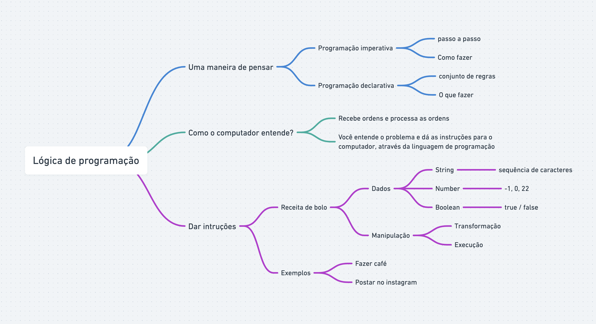

# AULA 02 - LÓGICA DE PROGRAMAÇÃO

## Conteúdo da aula

- Uma maneira de pensar?
- Como o computador entende?
- Dar instruções?

---

## UMA MANEIRA DE PENSAR?

A lógica de programação é um conjunto de princípios e regras que orientam a criação de algoritmos, que são sequência de passos lógicos e estruturados para resolver um problema específico. Essa disciplina envolve a organização e o fluxo de instruções de maneira coerentE, de modo a permitir que um programa de computador execute tarefas de forma eficiente e eficaz. A lógica de programação capacita os desenvolvedores a criar algoritmos compreensíveis, mantendo a clareza na expressão das soluções para problemas, facilitando a implementação e manutenção de software. Essa abordagem se concentra em raciocínio abstrato, estruturas de controle de fluxo e manipulação de dados, contribuindo para a criação de programas robustos e funcionais.

---

## COMO O COMPUTADOR ENTENDE?

O computador entende informações por meio de linguagem binária, que consistem em sequências de zeros (0) e uns (1), conhecidos como bits. Essa linguagem binária é a base da comunicação entre o hardware e o software de um computador.

No nível mais fundamental, o processador do computador interpreta essas sequência de bits como instruções para executar operações específicas. Essas intruções são codificadas em linguagem de máquina, que é uma representação numérica das operações que o processador deve realizar.

O software, por sua vez, fornece instruções nesse formato para o processador. Essas instruções podem ser parte de programas mais complexos, escritos em lingaugens de programção de alto nível, como C++, Python ou Java. Antes de executar um programa, ele é traduzido para a linguagem de máquina específica do processador.

O armazenamento de dados também é feito em formato binário, onde cada conjunto de bits representa informações como números, texto, imagens, ou qualquer outra forma de dados. A interpretação desses dados são realizadas conforme as intruções do software, que o processador executa.

Em resumo, o computador entende e processa informações atraves da interpretação de sequências de zeros e uns, traduzindo-as em instruções que podem ser executadas pelo processador para realizar operações específicas. Esse processo é fundamental para o funcionamento de todas as operações computacionais.

---

## COMO DAR INSTRUÇÕES?

Para dar instruções ao computador, é necessário utilizar uma linguagem de programação. As linguagens de programação são conjuntos de regras e símbolos que permitem aos desenvolvedores comunicar suas intenções ao computador. Essas linguagens são projetadas para serem compreensíveis tanto pelos humanos quanto pelos computadores.

Ao escrever um programa em uma linguagem de programação, o desenvolvedor utiliza uma sintaxe específica para expressar as operações desejadas. As intruções escritas no código-fonte são então traduzidas para linguagem de máquina durante o processo de compilação ou interpretação, tornando-as compreensíveis para o computador.

O código-fonte pode conter instruções para realizar uma ampla variedade de tarefa, desde cálculos matemáticos simples até operações complexas envolvendo manipulações de dados interações com o usuário e controle de dispositivos. A habilidade do programador está em criar algoritmos eficientes e lógicos para resolver problemas específicos.

Assim, ao dar instruções ao computador, os desenvolvedores utilizam a linguagem de programação para criar programas que definem as operações desejadas. Esses programas quando executados, permitem que o computador realize as tarefas planejadas de acordo com as instruções fornecidas no código-fonte.

