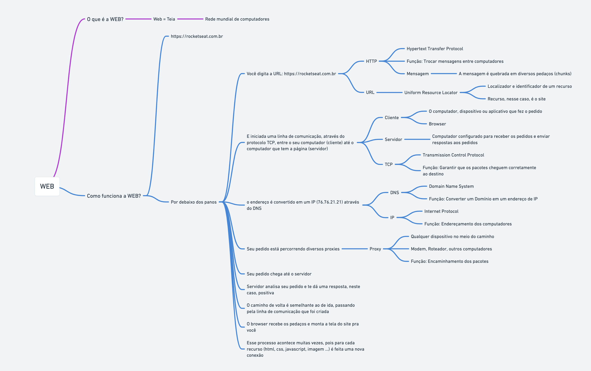

# AULA 03 - O QUE É E COMO FUNCIONA A WEB

## Conteúdo da aula

- O que é Web?
- Como funciona a web?

---

## O QUE É A WEB?

**"World Wide Web" (Rede Mundial de Computadores)**, é um sistema de informação global acessível através da internet. A Web é um espaço virtual onde documentos e recursos interconectados são identificados por URLs (Uniform Resource Locators) e podem ser acessados via navegadores web.

A Web foi desenvolvida por Tim Berners-Lee em 1989 e tornou-se amplamente disponível ao público em 1993. Ela é uma parte essencial da internet e é frequentemente usada de forma intercambiável com o termo "internet", embora esses dois conceitos não sejam exatamente iguais.

A World Wide Web permite que os usuários acessem uma variedade de conteúdos, incluindo páginas da web, imagens, vídeos, documentos, entre outros. A navegação na Web é facilitada pelos hiperlinks, que conectam informações em diferentes páginas e sites. A interconectividade da Web é fundamental para a criação de uma experiência de navegação rica e integrada.

Além disso, a Web é uma plataforma para uma ampla gama de serviços e aplicativos, como redes sociais, comércio eletrônico, serviços de busca, e-mail, streaming de mídia, entre outros. Ela desempenha um papel central na comunicação, na disseminação de informações e no acesso a recursos diversos em escala global.

---

## COMO FUNCIONA A WEB?

A Web funciona como um sistema de informações global que permite a criação, o compartilhamento e o acesso a conteúdos diversos através da internet. Aqui está uma explicação mais detalhada de como a Web opera:

- **Protocolo HTTP/HTTPS:**
  A comunicação na Web é baseada no Protocolo de Transferência de Hipertexto (HTTP) ou sua versão segura, HTTPS (HTTP Seguro). Esses protocolos definem como as mensagens são formatadas e transmitidas entre os clientes (navegadores web) e os servidores web.
- **Cliente e Servidor**:
  - **O sistema da Web envolve dois componentes principais**: o cliente e o servidor. O cliente é geralmente u navegador web (como Chrome, Firefox ou Safari) usado por uma pessoa, enquanto o servidor é um computador remoto que armazena e fornece os recursos (páginas da web, imagens, vídeos, etc.).
- **URLs (Uniform Resource Locators)**:
  Cada recurso na Web é identificado por uma URL única. As URLs são utilizadas pelos navegadores para localizar e recuperar esses recursos. Uma URL é geralmente composta por um esquema (como "http" ou "https"), um nome de domínio (por exemplo, www.exemplo.com) e um caminho específico para o recurso.
- **Navegadores Web**:
  Os navegadores web são aplicativos que os usuários utilizam para interagir com a Web. Eles interpretam o código HTML (Hypertext Markup Language) recebido dos servidores e exibem páginas da web formatadas para os usuários. Além disso, os navegadores podem executar scripts, como JavaScript, que adicionam interatividade às páginas.
- **HTML, CSS, e JavaScript**:
  As páginas da web são geralmente construídas usando HTML para estruturação, CSS (Cascading Style Sheets) para estilo e formatação, e JavaScript para interatividade. Essas linguagens trabalham em conjunto para criar uma experiência rica e dinâmica para o usuário.
- **Hiperlinks**:
  Hiperlinks são elementos fundamentais na Web. Eles permitem que os usuários naveguem de uma página para outra clicando em palavras, imagens ou botões destacados. Os hiperlinks são incorporados no código HTML e conectam recursos relacionados.
- **Requisições e Respostas**:
  Quando um usuário digita uma URL no navegador ou clica em um link, o navegador envia uma solicitação (request) para o servidor correspondente. O servidor processa a solicitação e retorna uma resposta (response) que pode incluir o conteúdo solicitado, informações de erro ou redirecionamentos.
- **Cookies e Sessões**:
  Cookies são pequenos arquivos de texto armazenados no computador do usuário que ajudam a manter o estado entre diferentes interações com um site. As sessões são usadas para manter a continuidade da interação do usuário enquanto ele navega em um site.
- **Segurança com HTTPS**:
  Para garantir a segurança das transmissões de dados entre o cliente e o servidor, muitos sites usam HTTPS. Isso envolve a criptografia dos dados transmitidos, tornando mais difícil para terceiros mal-intencionados interceptarem ou manipularem as informações.
- **Mecanismos de Busca**:
  Mecanismos de busca, como o Google, indexam milhões de páginas da web para ajudar os usuários a encontrar informações relevantes. Eles usam algoritmos complexos para classificar e apresentar os resultados mais relevantes para as consultas dos usuários.

Em resumo, a Web opera através da troca de mensagens entre clientes (navegadores) e servidores, usando protocolos padrão, URLs para identificação de recursos, e linguagens como HTML, CSS e JavaScript para criar e apresentar conteúdo de maneira visualmente atraente e interativa. Essa estrutura possibilita a disseminação global de informações e serviços através da internet.

- 
