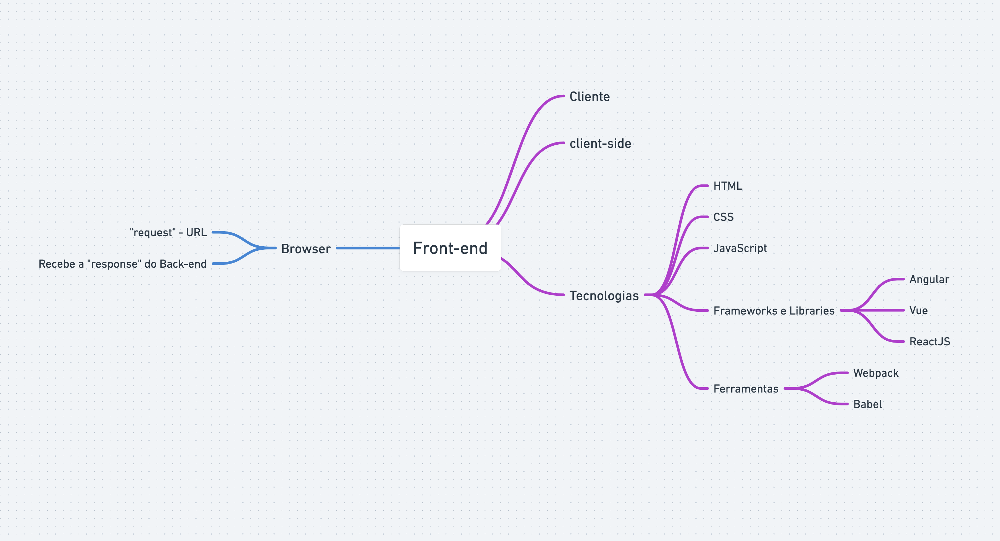

# AULA 04 - BACK-END X FRONT-END

## Conteúdo da aula

- O que é back-end?
- O que é front-end?

---

## Resumo da Aula

A relação entre o back-end e o front-end em desenvolvimento de software é fundamental para o funcionamento de aplicativos e sites. Eles colaboram para criar uma experiência de usuário completa e funcional. Aqui estão algumas das principais formas como eles se relacionam:

**Comunicação**: O front-end e o back-end se comunicam por meio de APIs (Interfaces de Programação de Aplicativos). O front-end envia solicitações (por exemplo, para buscar dados ou realizar ações) para o back-end, que processa essas solicitações e envia as respostas de volta para o front-end. Isso permite a interação entre o usuário e o servidor.
**Interface do Usuário (UI)**: O front-end é responsável por criar a interface do usuário

- `O que é back-end?` O back-end é a parte do sistema que lida com a lógica, o processamento de dados e a comunicação com o banco de dados. Aqui estão alguns detalhes importantes:

  - **Servidor**: O back-end é executado em um servidor que hospeda o software. Ele recebe solicitações do front-end e fornece respostas.
  - **Linguagens de Programação**: As linguagens de programação comuns para o back-end incluem Python, Ruby, PHP, Java, C#, Node.js, entre outras. Essas linguagens permitem a criação de lógica de negócios e a manipulação de dados.
  - **Banco de Dados**: O back-end interage com um banco de dados para armazenar e recuperar informações. SQL (Structured Query Language) é frequentemente usado para consultas de banco de dados.
  - **APIs (Interfaces de Programação de Aplicativos)**: O back-end fornece APIs que permitem que o front-end se comunique com o servidor. As APIs definem como os dados podem ser solicitados e atualizados.
  - **Segurança**: O back-end lida com a segurança, autenticação e autorização de usuários. Isso inclui proteção contra ameaças como injeção de SQL e autenticação de usuários.
  - 

---

- `O que é front-end?` O front-end é a parte do sistema com a qual os usuários interagem diretamente. Aqui estão alguns detalhes importantes:

  - **Interface do Usuário (UI)**: O front-end cria a interface que os usuários veem e com a qual interagem. Isso inclui layouts, botões, formulários e outros elementos visuais.
  - **Linguagens e Tecnologias**: O front-end usa HTML (HyperText Markup Language) para marcar o conteúdo, CSS (Cascading Style Sheets) para estilizar a página e JavaScript para adicionar interatividade.
  - **Navegador**: O código front-end é executado nos navegadores dos usuários, como Chrome, Firefox ou Safari.
  - **Requisições para o Back-End**: O front-end faz solicitações para o back-end por meio de APIs para buscar ou enviar dados. Isso permite a atualização em tempo real e a recuperação de informações do servidor.
  - **Responsividade**: O front-end é projetado para ser responsivo, adaptando-se a diferentes dispositivos, como smartphones, tablets e computadores
  - **Usabilidade**: O front-end se concentra na experiência do usuário, garantindo que o aplicativo seja fácil de usar e eficiente.

