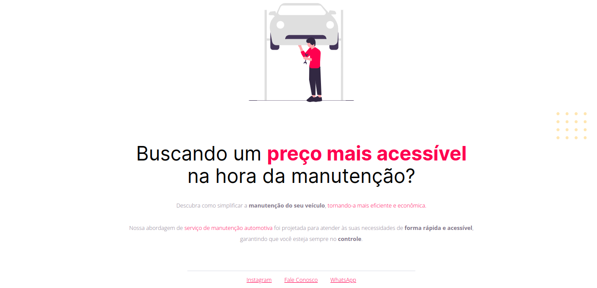
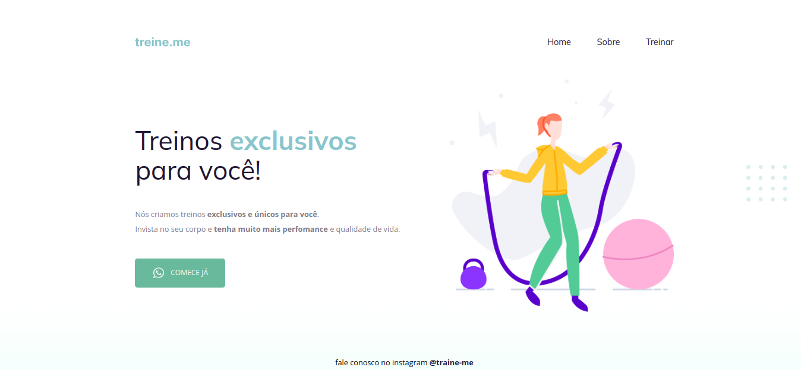

# STAGE 02 - INTRODUÇÃO AO HTML E CSS

## Conteúdos

### Stage 02.01 - Introdução ao HTML e CSS

|  Aulas  | Descrição                                                  |
| :-----: | :--------------------------------------------------------- |
| Aula 01 | **Navegador e editor de texto**                            |
| Aula 02 | **Introdução ao HTML**                                     |
| Aula 03 | **Introdução ao CSS**                                      |
| Aula 04 | **O que iremos desenvolver e o que é figma**               |
| Aula 05 | **Iniciando o projeto 01**                                 |
| Aula 06 | **Estruturando o projeto**                                 |
| Aula 07 | **Apresentação e posição dos elementos na tela**           |
| Aula 08 | **Aplicando fontes customizadas e inicianod o CSS**        |
| Aula 09 | **Trabalhando com cores e fontes**                         |
| Aula 10 | **Alinhando textos e elementos**                           |
| Aula 11 | **Mais ajustes de texto**                                  |
| Aula 12 | **Trabalhando com espaçamentos**                           |
| Aula 13 | **Bordas e classificações de elementos**                   |
| Aula 14 | **Posicionando elementos**                                 |
| Aula 15 | **Finalizando a etapa**                                    |
| Aula 16 | **Utilizando o codepen para enviar o projeto**             |
| Aula 17 | **Utilizando o Github para enviar os projetos e desafios** |

#### Projeto 01

---

### Stage 02.02 - Conhecendo novos conceitos de HTML e CSS

|  Aulas  | Descrição                                                     |
| :-----: | :------------------------------------------------------------ |
| Aula 01 | **Apresetando o projeto 02**                                  |
| Aula 02 | **Estruturando HTML com tags semânticas**                     |
| Aula 03 | **Finalizando a estrutura do HTML semântico**                 |
| Aula 04 | **O conceito de Box Model**                                   |
| Aula 05 | **Conhecendo a ferramenta de desenvolvimento DevTools**       |
| Aula 06 | **O conceito de flexbox do CSS**                              |
| Aula 07 | **Melhorias na acessibilidade e refatoração**                 |
| Aula 08 | **Adicionando fontes e melhorando os textos**                 |
| Aula 09 | **Aplicando alinhamentos e espaçamentos no main e no footer** |
| Aula 10 | **Configurando o botão**                                      |
| Aula 11 | **Background liner-gradient**                                 |
| Aula 12 | **Ajustes finais**                                            |

#### Projeto 02

