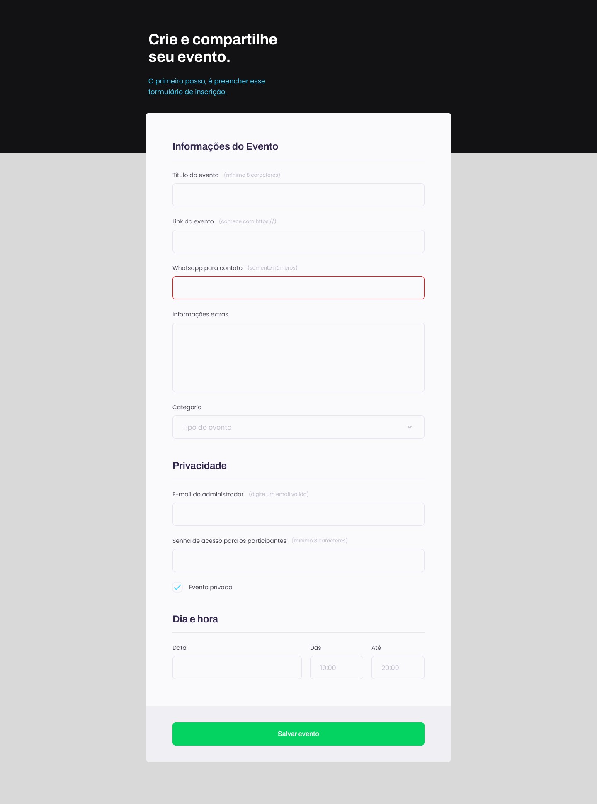
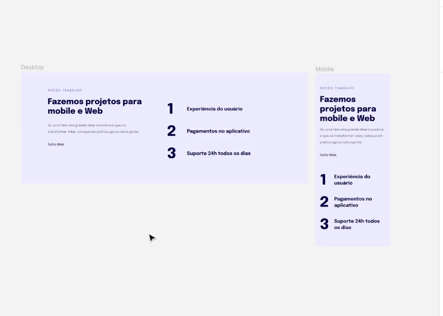

# STAGE 03 - AVANÇANDO NO HTML E CSS

## Conteúdos

### Stage 03.01 - Formulários, Validações e Customizações

|  Aulas  | Descrição                                                 |
| :-----: | :-------------------------------------------------------- |
| Aula 01 | **Visão geral do projeto**                                |
| Aula 02 | **Entendendo os campos HTML**                             |
| Aula 03 | **Como funciona os formulários no HTML**                  |
| Aula 04 | **Simulando a busca no google**                           |
| Aula 05 | **Iniciando a estrutura do HTML e configurando o VSCODE** |
| Aula 06 | **Inciando os estilos da página**                         |
| Aula 07 | **Agrupando campos com fieldset e legend**                |
| Aula 08 | **Formatando o campo de texto**                           |
| Aula 09 | **Ajustando novos campos dentro do fieldset**             |
| Aula 10 | **Estilizando o campo select**                            |
| Aula 11 | **Aplicando estilos aos agrupamentos restantes**          |
| Aula 12 | **Checkbox cutomizado e com acessibilidade**              |
| Aula 13 | **Criando estilos para o submit**                         |
| Aula 14 | **Validando campos e submetendo formulários**             |

---

### Stage 03.02 - Responsividade

|  Aulas  | Descrição                                    |
| :-----: | :------------------------------------------- |
| Aula 01 | **Introdução à responsividade**              |
| Aula 02 | **Estruturando o HTML**                      |
| Aula 03 | **Regras do mobile-first**                   |
| Aula 04 | **Regras das unidades de medidas flexiveis** |
| Aula 05 | **Continuando ajustes de texto**             |
| Aula 06 | **Finalizando ajustes da versão mobile**     |
| Aula 07 | **Versão desktop**                           |
| Aula 08 | **Finalizando a etapa**                      |

### Stage 03.03 - Avançando no CSS
