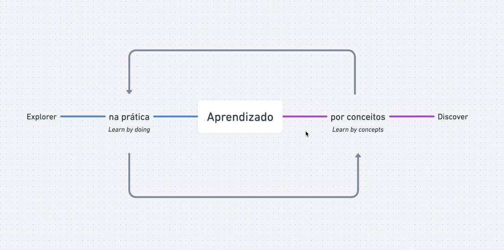

# Introdução

A aprendizagem é um processo fundamental na aquisição de conhecimento e habilidades. Ela pode ocorrer de diversas formas, sendo duas das mais comuns a aprendizagem por conceitos e a aprendizagem na prática.

A aprendizagem por conceitos envolve a assimilação de informações teóricas e a compreensão de princípios subjacentes a um determinado assunto. Ela permite aos alunos adquirir um entendimento sólido e abrangente de um tópico, fornecendo uma estrutura conceitual que facilita a aplicação e a adaptação do conhecimento em diferentes situações. A aprendizagem por conceitos oferece uma base sólida para o desenvolvimento de habilidades cognitivas, críticas e analíticas, que são essenciais para a resolução de problemas complexos.

Por outro lado, a aprendizagem na prática envolve a experiência direta e a aplicação prática do conhecimento em situações reais. Embora seja uma abordagem valiosa para o desenvolvimento de habilidades específicas e o aprimoramento da proficiência, a aprendizagem na prática, por si só, não oferece a compreensão profunda e o contexto conceitual necessários para abordar desafios complexos e em constante evolução. Ela pode levar a abordagens simplistas e a soluções superficiais de problemas.

A aprendizagem por conceitos é a melhor forma de aprendizado, pois fornece uma base sólida e flexível para a aquisição de conhecimento. Ela permite aos alunos compreender os princípios subjacentes e os padrões que governam um campo de estudo, capacitando-os a aplicar seu conhecimento de maneira mais eficaz e inovadora. A aprendizagem na prática pode ser um complemento valioso, mas não pode substituir a compreensão profunda dos conceitos.

Em resumo, enquanto a aprendizagem na prática desempenha um papel importante no desenvolvimento de habilidades e na aplicação do conhecimento, ela não pode servir como a base exclusiva para a aquisição de conhecimento. A aprendizagem por conceitos é a pedra angular de uma educação sólida, proporcionando a compreensão necessária para enfrentar desafios complexos e em constante mudança de forma eficaz e inovadora.

